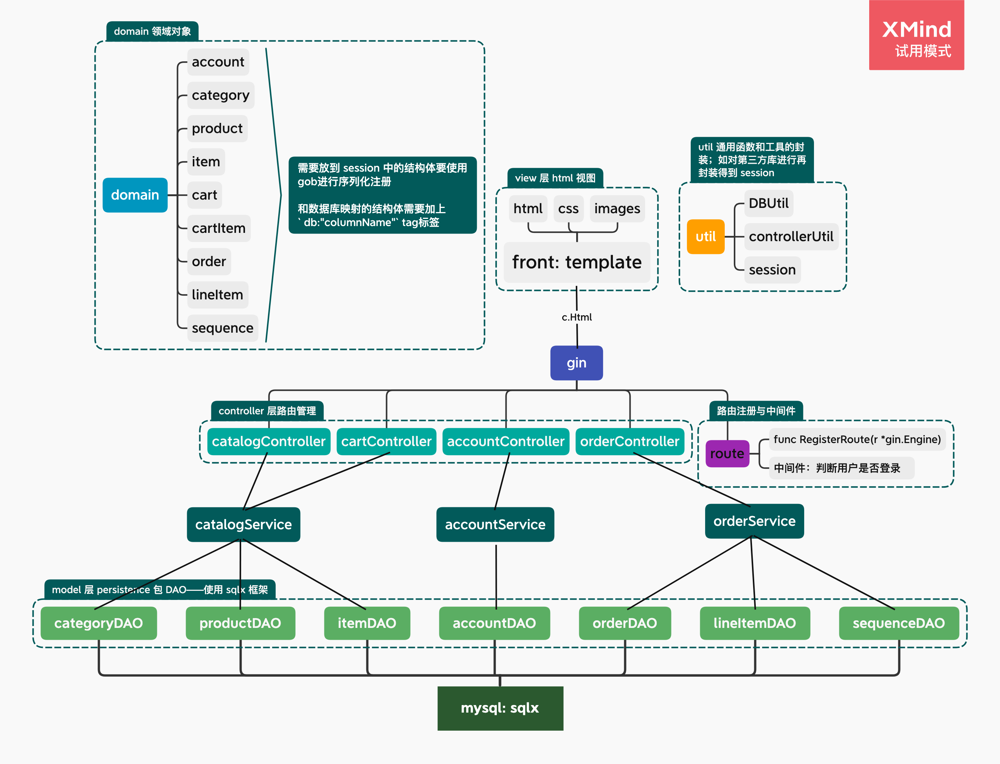

# goPetStore: use gin and sqlx
使用 go语言 实现的 jpetstore

通过重构原无框架版，使用 gin 和 sqlx 进行框架开发

原 java 无框架版：https://github.com/SwordHarry/Jpetstore 

原 java SpringBoot + Mybatis + thyemeleaf版：https://github.com/SwordHarry/mypetstoreSpringBoot

原 go 无框架版：https://github.com/SwordHarry/gopetstore


## 业务模块
- 商品模块
    - category
    - product
    - item
    - search
- 购物车模块
    - cart
- 用户模块
    - account
- 订单模块
    - order
    - lineItem
    - sequence

## 架构
template + gin + sqlx + mysql<br/>
原采用 gorm，但其具有一定入门门槛和学习成本，其关联查询和关联插入搞不清楚。。。<br/>
并且比对起来像 java 的 herbinate，故移用轻小的 sqlx<br/>



### gin

路由框架，类比起来比较像 node 的 koa 框架；洋葱模型，方便添加中间件，logger 等；

个人认为是围绕 controller 层展开的框架，从无框架转移使用起来很平滑

### sqlx

是在原生 database/sql 之上封装，平滑过渡，但还是逃不过使用 sql 语句，并需要对 sql 语句做一定的修改；

除原生 api 外，提供了 `Get`、`Select`、`NamedQuery`、`NamedExec`等方便的框架，省去原生的`Scan`过程；

但是：**需要对 domain 结构体进行 标签 定义并且和 sql 语句中的属性别名进行对应，区分大小写**

```go
const getAccountByUsernameSQL = `SELECT USERNAME as userid, EMAIL as email, CITY as city,STATE as state, ZIP as zip, COUNTRY as country, PHONE as phone FROM ACCOUNT WHERE USERID = ?`


type Account struct {
	UserName  string `db:"userid"`
	Email     string `db:"email"`
	FirstName string `db:"firstname"`
	LastName  string `db:"lastname"`
	Status    string `db:"status"`
	Address1  string `db:"addr1"`
	Address2  string `db:"addr2"`
	City      string `db:"city"`
	State     string `db:"state"`
	Zip       string `db:"zip"`
	Country   string `db:"country"`
	Phone     string `db:"phone"`
}

d.Get(a, getAccountByUsernameSQL, userName) // d -> (*sqlx.DB)
```

